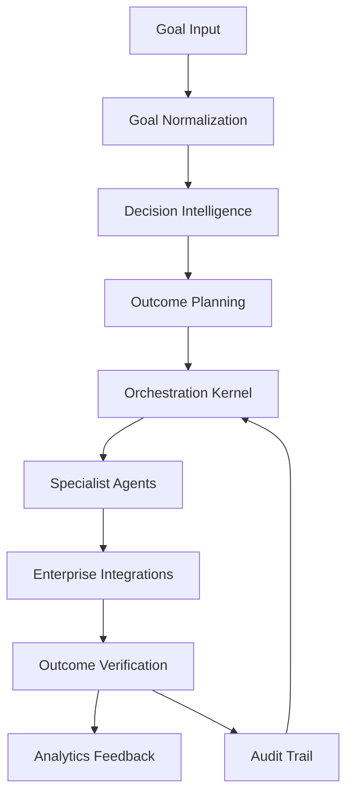

# Architecture Overview

NeuroWeave AI is a modular orchestration platform that turns business goals into verified outcomes via planning, simulation, agent execution, and verification.

## Execution Flow

## Core Modules

### 1) Goal Intake Engine
- Parses plain-language objectives.
- Captures constraints, SLAs, budgets, and risk tolerance.
- Produces structured `Goal` models.

### 2) Decision Intelligence (Mandatory)
- Simulates outcomes before execution.
- Compares strategies and scores risk/confidence.
- Generates assumptions and pre-flight validation.

### 3) Outcome Planner
- Builds a dependency-aware task DAG.
- Detects missing data and requests it.
- Defines checkpoints and escalation gates.

### 4) Orchestration Kernel
- Dispatches tasks to specialist agents.
- Supports retries, approvals, and distributed execution.
- Maintains execution state and audit trail.

### 5) Specialist Agents
- Sales, support, compliance, market intelligence, IT operations.
- Standardized task schema with structured outputs.
- Async execution support.

### 6) Integration Layer
- CRM, ERP, ticketing, email, and API connectors.
- Credential vault integration with RBAC.
- Deterministic audit logging.

### 7) Outcome Verification
- Validates success metrics and SLAs.
- Calculates ROI and generates evidence.
- Emits analytics feedback.

## Data Model
- **Goal**: objective, constraints, success metrics, SLAs, risk tolerance, budget.
- **Plan**: task DAG, strategy, checkpoints.
- **AgentTask**: task payload, required capabilities.
- **ExecutionState**: status, history, current task.
- **Outcome**: metrics, ROI, evidence.
- **AuditRecord**: actor, action, resource, metadata.

## Non-Functional Requirements
- Scalable distributed execution (Temporal-ready).
- Observability and tracing.
- Resilient retries + escalation.
- Secure secrets handling + RBAC.
- Deterministic audit trail.

## Current Persistence Implementation
- Goal and plan records are persisted via a SQLite-backed model store (`SQLiteModelStore`).
- API routes use persistent stores instead of process-local dictionaries.
- Database path is configurable via `NEUROWEAVE_DB_PATH`.
